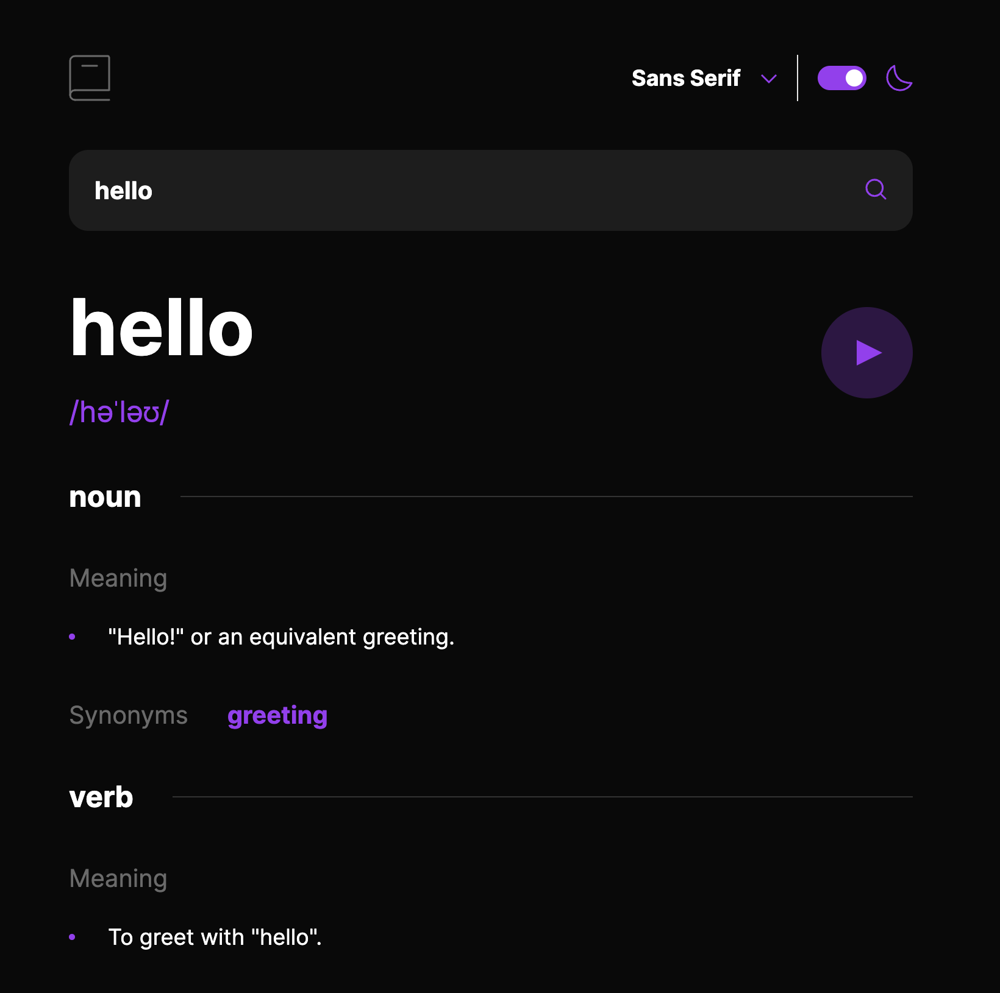

# Frontend Mentor - Dictionary web app solution

### Description

This is a solution to the [Dictionary web app challenge on Frontend Mentor](https://www.frontendmentor.io/challenges/dictionary-web-app-h5wwnyuKFL).

### The challenge

Users should be able to:

- Search for words using the input field
- See the Free Dictionary API's response for the searched word
- See a form validation message when trying to submit a blank form
- Play the audio file for a word when it's available
- Switch between serif, sans serif, and monospace fonts.
- Switch between light and dark themes
- Mode and fonts are saved to local storage and loaded on page load.
- View the optimal layout for the interface depending on their device's screen size
- See hover and focus states for all interactive elements on the page.

### Built With

- Semantic HTML5.
- CSS.
- Vanilla Javascript.
- BEM.

### Links

- GitHub URL: [https://github.com/norrland90/dictionary-web-app]
- Live Site URL: [https://norrland90.github.io/dictionary-web-app]

### Contact

Created by [@norrland90](https://github.com/norrland90) - feel free to contact me!
